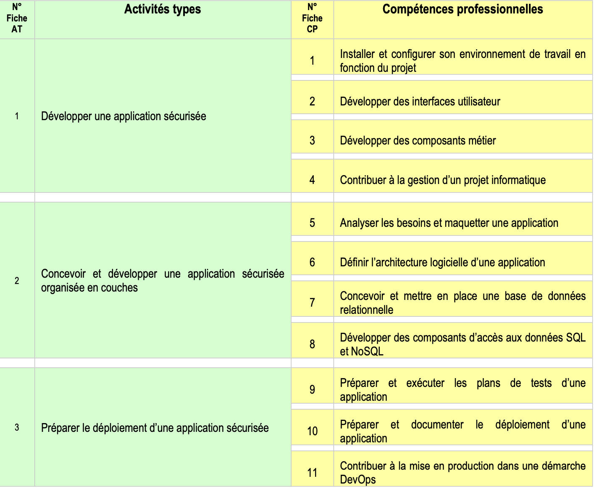

## Introduction
Ce dossier de projet démontre les compétences acquises pour l'obtention du titre professionnel "Concepteur et Développeur d'Applications". Il présente l'ensemble du processus de conception et de développement d'une application.

## Table des matières
1. **Présentation**
   - [Présentation de l'Entreprise](presentation/presentation-entreprise.md)
   - [Présentation du Service](presentation/presentation-service.md)
   - [Présentation personnelle](presentation/se-presenter.md) *(à venir)*

2. **Expression des Besoins**
   - [Contexte et Enjeux](expression-des-besoins/contexte-et-enjeux.md)
   - [Objectifs](expression-des-besoins/objectifs.md)
   - [Contraintes et Opportunités](expression-des-besoins/contraintes-opportunites.md)
   - [Exigences Fonctionnelles](expression-des-besoins/exigences-fonctionnelles.md)

3. **Spécifications**
   - Spécifications Fonctionnelles
      - [Livrables attendus](specifications-fonctionnelles/livrables-attendus.md)
   - Spécifications Techniques
      - [Choix de la stack technique](/specifications-techniques/front-end/choix-stack.md) *(à venir)*

4. **Conception**
   - [Dictionnaire de Données](conception/dictionnaire-de-donnees.md)
   - Base de Données
      - [Modèle Conceptuel de Données](conception/bdd/MCD.png)
      - [Modèle Logique de Données](conception/bdd/MLD.png)
   - Diagrammes
      - [Diagramme de Classe](conception/diagrammes/diagramme-de-classe.md) *(à venir)*
      - [Diagramme de Séquence](conception/diagrammes/diagramme-de-sequence.md) *(à venir)*
   - [Maquettes et Prototypes](conception/maquettes-et-prototypes/) *(à venir)*

5. **Développement**
   - Back-end
      - [Documentation API](developpement/back/documentation-api/documentation-api.md) *(à venir)*
   - Front-end
      - [Structure du Code Source](developpement/structure-code-source/structure.md) *(à venir)*
   - DevOps
      - [Documentation DevOps](developpement/devops/documentation-devops/documentation-devops.md) *(à venir)*

6. **Déploiement**
   - [Procédures de Déploiement](deploiement/procedures-deploiement/procedures-deploiement.md) *(à venir)*
   - [Maintenance Applicative](deploiement/maintenance-applicative/maintenance-applicative.md) *(à venir)*

7. **Outils**
   - [Gestion de Projet](outils/gestion-de-projet/README.md) *(à venir)*
   - [Outils Utilisés](outils/outils-utilises.md) *(à venir)*

8. **Veille technologique**
   - [Bilan de Veille](veille/bilan-veille.md) *(à venir)*
   - [Mes réussites et mes difficultés](veille/reussites-difficultes.md) *(à venir)*
   - [Si c'était à refaire ?](veille/si-cetait-a-refaire.md) *(à venir)*

## Liste des compétences du référentiel couvertes par le projet
